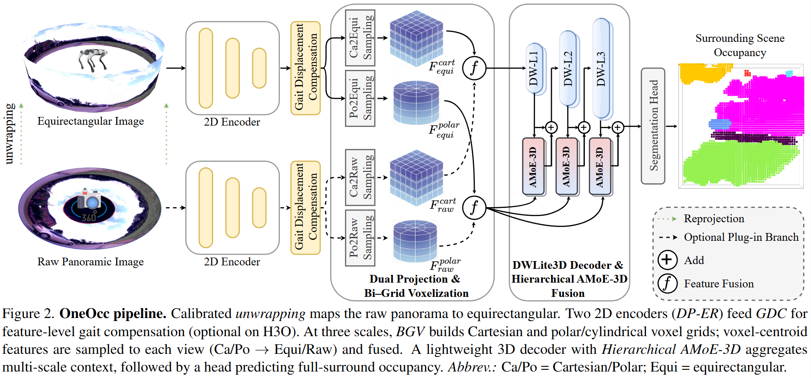

# OneOcc: Semantic Occupancy Prediction for Legged Robots with a Single Panoramic Camera

## ✨ Quick Summary
**OneOcc** is a **vision-only panoramic** semantic occupancy framework for **legged/humanoid robots**. It handles **gait-induced body jitter** and **360° continuity**, achieves **state-of-the-art** results, and remains **lightweight and deployable**.
<p align="center">
  
</p>

---

## 🔬 Method at a Glance
- **Dual-Projection Fusion (DP-ER):** Uses both annular panorama and equirectangular projections to preserve 360° continuity and improve grid alignment.
- **Bi-Grid Voxelization (BGV):** Joint reasoning in Cartesian and cylindrical/polar voxel spaces to reduce discretization bias and sharpen boundaries.
- **Hierarchical AMoE-3D:** Dynamic multi-scale fusion for long-range and occlusion reasoning with a lightweight decoder.
- **Gait Displacement Compensation (GDC):** Plug-and-play feature-level motion correction **without extra sensors** to mitigate gait jitter.

---

## 🧪 Benchmarks & Key Results
- **QuadOcc** (real quadruped, first-person 360°):  
  24K frames (stride-5 training), 6 classes, **64×64×8 grid (0.4 m/voxel)**; day/dusk/night; heterogeneous sequence split.  
  **OneOcc mIoU = 20.56**, surpassing LiDAR **LMSCNet (18.44)** and the strongest vision baseline **MonoScene (19.19)**.

- **Human360Occ (H3O)** (CARLA human-ego 360°, simulated gait):  
  16 maps, diverse weather/lighting; provides **RGB, depth, occupancy (two resolutions), and poses**; report **within-city** and **cross-city**.  
  **OneOcc mIoU = 37.29 (within-city, +3.83)** and **32.23 (cross-city, +8.08)** versus the best vision baseline.

*Lighting robustness on QuadOcc:* OneOcc leads the best vision baseline in **day (21.15 vs. 18.58)** and **dusk (19.86 vs. 15.14)**; at **night**, it obtains **13.50 mIoU** (vs. 14.20) with higher precision.

---

## 🧱 Repository Status & Roadmap
- [x] Sync preprint abstract/method/results (this README)
- [ ] Release training/inference **code** (`oneocc/`)
- [ ] Release **checkpoints** (`assets/checkpoints/`)
- [ ] Data preparation guides (**QuadOcc / H3O**)

> Code and datasets will be made public upon publication.

---
## 📝 Citation

If you find this work useful, please cite:

```bibtex
@misc{shi2025oneoccsemanticoccupancyprediction,
  title         = {OneOcc: Semantic Occupancy Prediction for Legged Robots with a Single Panoramic Camera},
  author        = {Hao Shi and Ze Wang and Shangwei Guo and Mengfei Duan and Song Wang and Teng Chen and Kailun Yang and Lin Wang and Kaiwei Wang},
  year          = {2025},
  eprint        = {2511.03571},
  archivePrefix = {arXiv},
  primaryClass  = {cs.RO},
  url           = {https://arxiv.org/abs/2511.03571}
}

